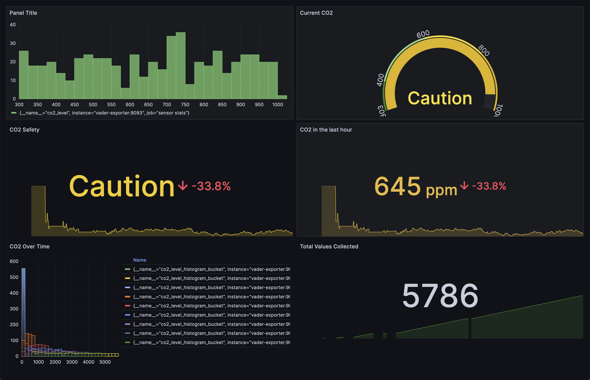

# Vader 

## What's this? 
"edge device" for monitoring various atmospheric parameters

### Architecture 
At a high level vader consists of three components

 

## **Vader**
the main device that collects atomospheric conditions, it consists of an [esp32](https://www.espressif.com/en/products/socs/esp32) and an [MQ7 gas sensor](https://www.sparkfun.com/datasheets/Sensors/Biometric/MQ-7.pdf) , these monitor co2 levels and publish data over MQTT 

## **MQTT**
MQTT is a lightweight, publish-subscribe, machine to machine network protocol for message passing, its perfect for our use case becasue it's lightweight and easy to setup. We currently run MQTT as [docker container](https://docs.docker.com/guides/walkthroughs/what-is-a-container/) ,  take a peek at the infra directory for moore information on how to setup. 

## **Exporter** 
The exporter takes the mesages it recieves from MQTT and transforms them into various [prometheus metrics](https://prometheus.io/), prometheus suits our current use case as the data we collect is timeseries ,  and we want to observe the data over time, this is might change in the future but for now this would work. 

If you'd like to learn more about building exporters here are some recommendations:

https://percona.community/blog/2021/07/21/create-your-own-exporter-in-go/ 

https://blog.stackademic.com/create-prometheus-custom-exporter-with-go-429f9c328b6c

Take a look at the exporter directory and see how we do it!!

### Metrics collected 
We currently collect 3 major metrics using the exporter: 

- C02 level: a prometheus gauge of the current Co2 level
- co2Histogram:  a historgram of the Co2 levels so we can track it over time 
- co2ValueCounter:  a counter of how many values we have collected. 

- Avg co2 in the last hour: a neat query which takes the co2 level over the last hour and returns the average.

Looking to learn more about prometheus metric types? Take a look at this article:
https://chronosphere.io/learn/an-introduction-to-the-four-primary-types-of-prometheus-metrics/

## **Visualization**

For visualizing the data we chose [Grafana](https://grafana.com/) as it allows us to quickly build dashboards based on the data we collect from the exporter. 

## Tech Stack 

- MQTT for message passing 
- Prometheus for collecting metrics 
- Go for our custom exporter 
- Docker for containerizing workloads.

## Running Locally

## Todos

- [ ] integrate prometheus blackbox exporter 

